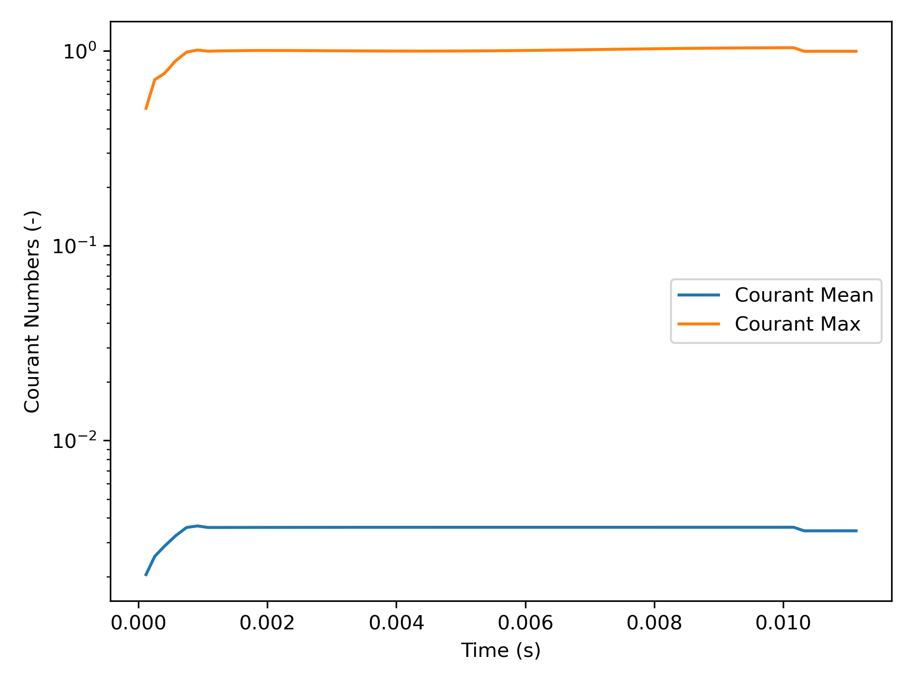
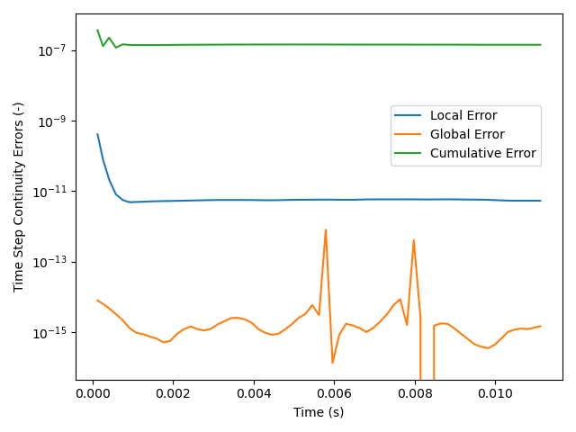
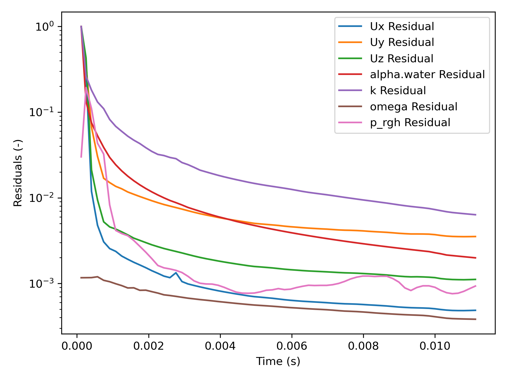

# openFoamEvaluation
openFoamEvaluation : Python script for evaluating OpenFOAM simulation

---

## Description
The openFoamEvaluation.py is a Python script that evaluates OpenFOAM simulations by analyzing the log file generated during computations. The script automatically detects whether a simulation is steady-state or transient. For transient simulations, it plots Courant number evaluations. By default, the script plots time step continuity errors and identifies available variables for residual plotting. Evaluating a simulation log file provides valuable insights into the simulation's validity, convergence behavior, and overall stability.

---

  

---

## Features
- Automatic detection of steady-state or transient simulations
- Time step continuity error plotting
- Automatic detection of all available solved variables for residual plotting
- Courant number evaluation for transient cases
- Graph smoothing with optional method choices
- Interactive and auto-saved graphs
- CSV table generation from evaluated data

---

## Important Notes
To generate a log file for evaluation, use the `tee` command in Terminal or Windows Subsystem for Linux (WSL). For example:
```bash
$ interFoam | tee log.txt
```
For Windows users, please consult additional references for equivalent commands in Command Prompt or PowerShell.

---

## Prerequisites
Install the required dependencies with the following command:
```bash
$ pip install matplotlib numpy scipy statsmodels
```
If the dependencies are already installed, you can skip this step.

---

## Usage

### Command Prompt, Terminal, or Python Console
To evaluate an OpenFOAM simulation log file, place the openFoamEvaluation.py and the log file in the same directory, open Command Prompt or Terminal to that directory, and execute the following command:
```bash
python openFoamEvaluation.py --file logfilename
```
**Arguments:**
- `--file`: Specifies the log file to be analyzed. Replace `logfilename` with the actual name of your log file, e.g., `log.txt`.

or simply run:
```bash
python openFoamEvaluation.py
```
and the script will ask the log file name to the user.

### Jupyter Notebook or Google Colab
Currently, the code is exclusive to be used in Command Prompt or Terminal.

---

## Optional Modifications

### Graph Smoothing
Options for data smoothing are:
- `"Lowess"` (default) — uses Locally Weighted Regression method
- `"Gauss"` — applies a 1D Gaussian Filter Kernel method
- `"False"` — no smoothing

To modify this, change the value of `smooth` on line 62 in the script. Example:
```python
smooth = "Gauss"
```

### Customized Residual Variables
To manually specify custom variables for residual plotting, modify the `variables` list on line 302 of the script. For example:
```python
variables = ["alpha.water", "Ux", "Uy", "Uz", "p_rgh", "omega", "k"]
```
